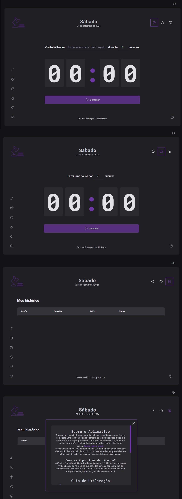

<table align="left">
    <tr>
        <td> <b>
            <a href="README.md"> 🇺🇸 English </a>
            </b>
        </td>
        <td>
              <a href="README-BR.md"> 🇧🇷 Português </a>
        </td>
    </tr>
</table>


<p align="right">
  <a href="#-technologies">Technologies</a>&nbsp;&nbsp;&nbsp;|&nbsp;&nbsp;&nbsp;
  <a href="#-project">Project</a>&nbsp;&nbsp;&nbsp;|&nbsp;&nbsp;&nbsp;
  <a href="#-layout">Layout</a>&nbsp;&nbsp;&nbsp;|&nbsp;&nbsp;&nbsp;
  <a href="#-run">Run</a>&nbsp;&nbsp;&nbsp;|&nbsp;&nbsp;&nbsp;
  <a href="#-deployment">Deploy</a>
</p>

<br> <br>

# Pomo App


 


<br>

## 🚀 Project

This is an application that puts into practice the Pomodoro concepts, a time management technique that can help you focus on any task, such as studying, writing, coding, or researching, through timed intervals known as "cycles."

### ⚙ Features

- Add, view, and remove tasks
- Timer per task
- Available in 4 languages (Portuguese, English, Spanish, and French)
- Music player
- Tutorial guide

### 🛸 Requirements
- React v18.2.0
- Node v18.17.1
- Npm v10.4.0
- Vite v4.4.5

### 🛠 Run the Application
To run the application on your local machine, follow these steps:
<br>
1. Clone the repository using the command:

```bash
git clone https://github.com/iMetzker/pomo-app.git
```

2. Open the project in your development environment.

3. Ensure that Yarn is installed. If not, open the terminal in your development environment and run the command:

```bash
npm install
```

4. Ensure that all dependencies are added to run the project:

```bash
npm install zod
```

```bash
npm install date-fns --save
```

```bash
npm install react-i18next
```

```bash
npm install i18next
```

```bash
npm install react-router
```

```bash
npm install @hookform/resolvers
```

```bash
npm install styled-components
```

5. Start the server to view the project using the command:

```bash
npm run dev
```


## 🛸 Technologies

This project was developed using the following technologies:

- React
- TypeScript
- React-hook-form
- Date-fns
- Styled components
- Zod

## 💻 Layout



## Project Deployment

<a href="https://timetofocus-imetzker.netlify.app/" target="_blanc">Visit the live project</a>